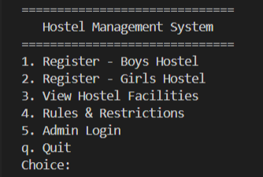
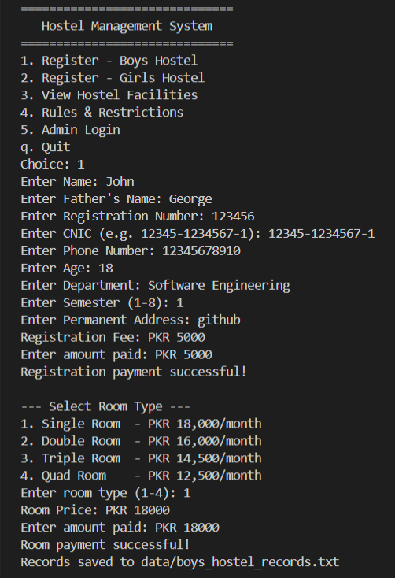
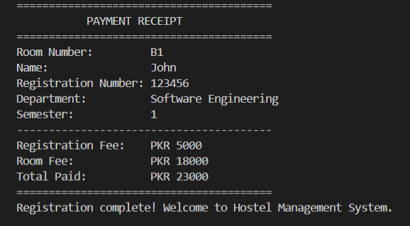
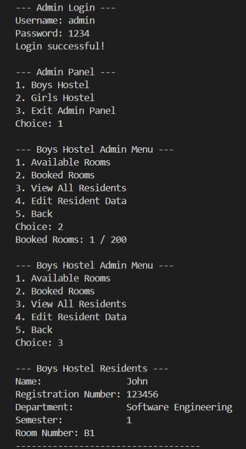

# 🏨 Hostel Management System


> A console-based Hostel Management System built in C++ that handles student registration, room assignment, payment processing, and admin management for a university hostel — demonstrating core OOP principles.

---

## 📋 Table of Contents

- [Overview](#overview)
- [OOP Concepts Demonstrated](#oop-concepts-demonstrated)
- [Features](#features)
- [Project Structure](#project-structure)
- [Getting Started](#getting-started)
- [How to Run](#how-to-run)
- [Usage Guide](#usage-guide)
- [Screenshots](#screenshots)
- [Future Improvements](#future-improvements)
- [Author](#author)

---

## Overview

Hostel Management System is a terminal-based management system with two separate wings — **Boys Hostel** and **Girls Hostel** — each with 200 rooms. It simulates real-world hostel operations including student registration, room allocation, fee collection, and administrative record management.

The project was built as an **Object-Oriented Programming (OOP)** course project at Capital University of Science and Technology (CUST).

---

## OOP Concepts Demonstrated

| Concept | Where Used |
|---|---|
| **Classes & Objects** | `Resident`, `Room`, `Hostel`, `Payment` |
| **Inheritance** | `BoysHostel` and `GirlsHostel` both inherit from `Hostel` |
| **Polymorphism** | `displayFacilities()` and `displayRules()` are virtual — overridden in each subclass |
| **Abstraction** | `Hostel` is an abstract base class (has pure virtual functions) |
| **Encapsulation** | All class data is private; accessed via public getters/setters |
| **Templates** | `Payment<T>` works with both `int` and `double` fee types |
| **File I/O** | Resident records are persisted to `.txt` files in `/data` |
| **Vectors** | Dynamic lists of `Resident` and `Room` objects |

---

## Features

- **Student Registration** — Collects full personal, academic, and contact details
- **Automatic Room Assignment** — Assigns the next available room (B1–B200 or G1–G200)
- **Payment Processing** — Handles registration fee (PKR 5,000) + room fee based on type
- **Payment Receipt** — Formatted receipt printed after successful registration
- **Admin Panel** — Password-protected dashboard for hostel management
- **Room Status** — View available vs. booked room counts
- **Resident Records** — View all registered residents with full details
- **Edit Resident Data** — Admin can update name, father's name, address, and phone
- **File Persistence** — Records saved to `data/boys_hostel_records.txt` and `data/girls_hostel_records.txt`
- **Input Validation** — Handles invalid input (letters where numbers expected) without crashing

### Room Pricing

| Room Type | Capacity | Monthly Fee |
|---|---|---|
| Single Room | 1 person | PKR 18,000 |
| Double Room | 2 persons | PKR 16,000 |
| Triple Room | 3 persons | PKR 14,500 |
| Quad Room | 4 persons | PKR 12,500 |

---

## Project Structure

```
hostel-management-system/
├── src/
│   └── main.cpp              # All source code (single-file project)
├── data/                     # Auto-created at runtime
│   ├── boys_hostel_records.txt
│   └── girls_hostel_records.txt
├── docs/
│   └── class_diagram.md      # UML class relationships
├── screenshots/              # Demo screenshots
├── .gitignore
├── CHANGELOG.md
└── README.md
```

---

## Getting Started

### Prerequisites

You need a C++ compiler that supports **C++17** or later:

- **Windows** — [MinGW-w64](https://www.mingw-w64.org/) or [MSVC (Visual Studio)](https://visualstudio.microsoft.com/)
- **Linux/Mac** — `g++` (usually pre-installed; install via `sudo apt install g++` on Ubuntu)

Verify your compiler:
```bash
g++ --version
```

### Installation

```bash
# Clone the repository
git clone https://github.com/YOUR_USERNAME/hostel-management-system.git

# Navigate into the project folder
cd hostel-management-system
```

---

## How to Run

### Linux / macOS

```bash
# Compile
g++ -std=c++17 -o hostel_management src/main.cpp

# Run
./hostel_management
```

### Windows (Command Prompt)

```cmd
:: Compile
g++ -std=c++17 -o hostel_management.exe src\main.cpp

:: Run
hostel_management.exe
```

### Windows (Visual Studio)

1. Open Visual Studio → **Create New Project** → **Empty C++ Project**
2. Add `src/main.cpp` to the project
3. Press **Ctrl+F5** to build and run

---

## Usage Guide

### Main Menu

```
==============================
   Hostel Management System
==============================
1. Register — Boys Hostel
2. Register — Girls Hostel
3. View Hostel Facilities
4. Rules & Restrictions
5. Admin Login
q. Quit
```

### Registering a Student

1. Select option `1` (Boys) or `2` (Girls)
2. Enter all required personal details
3. Pay the registration fee (PKR 5,000)
4. Select a room type (1–4 occupants)
5. Pay the room fee
6. Receipt is printed and record saved to file

### Admin Login

- **Username:** `admin`
- **Password:** `1234`

From the admin panel you can view room availability, browse all residents, and edit resident details by registration number.

---

## Screenshots

### Main Menu


### Student Registration


### Payment Receipt


### Admin Panel


---

## Future Improvements

- [ ] **Search by name** in addition to registration number
- [ ] **Room removal / checkout** — currently rooms can only be assigned, not freed
- [ ] **CSV export** of resident records for spreadsheet compatibility
- [ ] **Password hashing** — admin password stored as a hash, not plain text
- [ ] **Date tracking** — record check-in date and calculate monthly fees
- [ ] **Multiple admin accounts** with different permission levels
- [ ] **Guest/visitor log** for tracking hostel visitors
- [ ] **Fee receipt numbering** for proper accounting records

---

## What I Learned

- Designing a class hierarchy using inheritance and abstract base classes
- Applying polymorphism so one function call (`displayFacilities`) behaves differently per hostel type
- Using C++ templates to write type-flexible code (`Payment<double>`)
- Managing file I/O to persist data across program runs
- Refactoring duplicate code into reusable functions (`registerResident`, `collectResidentDetails`)
- Adding input validation to prevent crashes on unexpected user input

---

## Author

**M. Mansoor Ur Rehman**
BSE233094 | Department of Software Engineering
Capital University of Science and Technology (CUST), Islamabad

- 📧 mansoorshakeel196@gmail.com
- 💼 www.linkedin.com/in/mmansoorurrehman
- 🐙 https://github.com/imnxr

---


